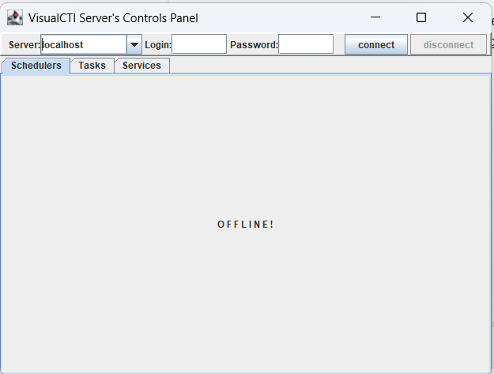
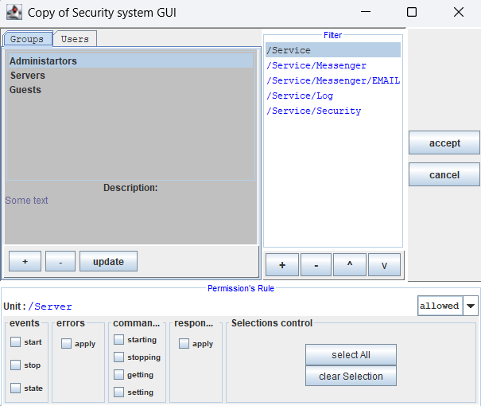
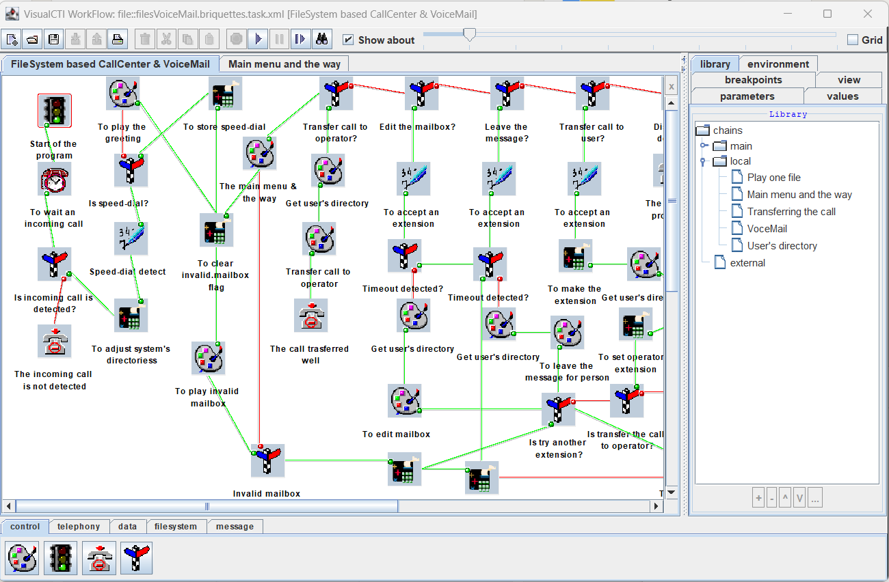
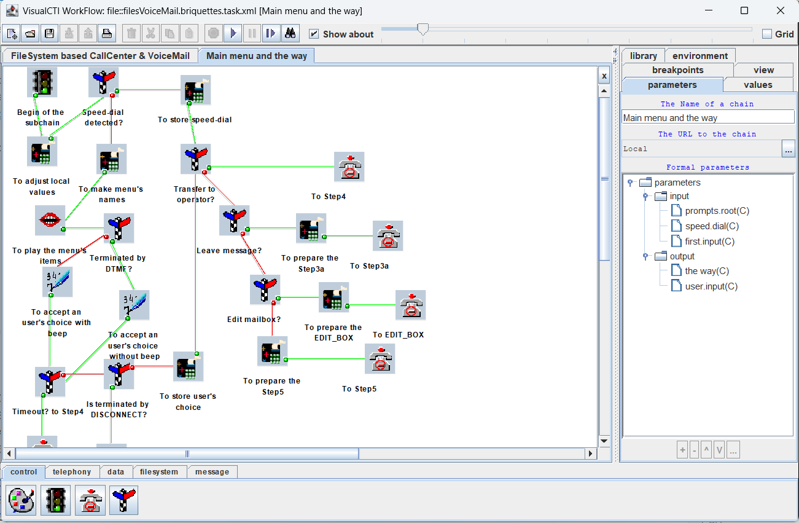

# Was there the Java Life before Spring and without Java EE? YES!

### Visual CTI is the Answer.
#### Hand-made computer-telephony-integration (CTI) applications server.
Application server working with telephony hardware executing prepared and deployed to particular telephony-channel algorithms. Service is observed and managed through Java RMI from the Control Panel.

With advanced Access Control System

#### Hand-made integrated-developers-environment (IDE).
Tool which allows engineers to focus on business algorithms not a programming language or libraries features.

Using Called Sub-Routines as well

Tool allows to design develop and debug the application. 
Developed application can be deployed to the application server directly. 
Tool can connect to server's telephony channel in order to test algorithm on the real hardware.

### Just try it!